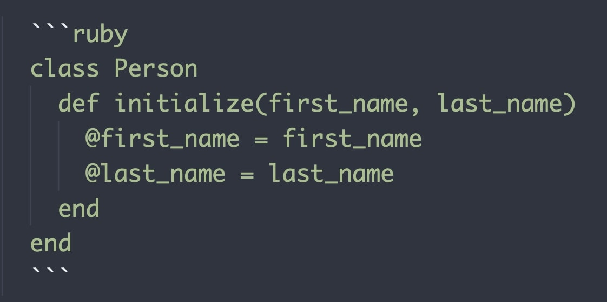

# Book syntax

Chapter content is in Markdown format but currently, not all elements from Markdown syntax are supported. The following elements are currently supported:

```markdown
# This is the chapter title
## This is the header h2
### This is the header h3
#### This is the header h4

This is simple paragraph with some additional formatting like **bold** or `code` text.
```

Here is the formatting of the above paragrahp: This is simple paragraph with some additional formatting like **bold** or `code` text.

## Formatting lists

You can use two types of lists. Ordered:

```markdown
1. The first element
2. The second element
3. The last element
```

The above code will result in:

1. The first element
2. The second element
3. The last element

You can also use unordered list:

```markdown
* The first element
* The second element
* The last element
```

The above code will result in:

* The first element
* The second element
* The last element

## Formatting code

You can format the snippet of code:



The above code will result in the following text:

```ruby
class Person
  def initialize(first_name, last_name)
    @first_name = first_name
    @last_name = last_name
  end
end
```

This time I used image as reference to not confuse parser with nested markdown syntax. Instead of `ruby` you can use any other language or technology like `javascript`, `html`, `css`, `yaml`, `sql`, etc.

## Images

Currently, only `jpg` images are supported as they are not problematic during the rendering process (and they are rendered fast). Please move all images to the `images` directory in the chapter directory. If you would use the following code in `introduction` chapter:

```markdown

```

The parser would look for `content/introduction/images/picture.jpg` file.
